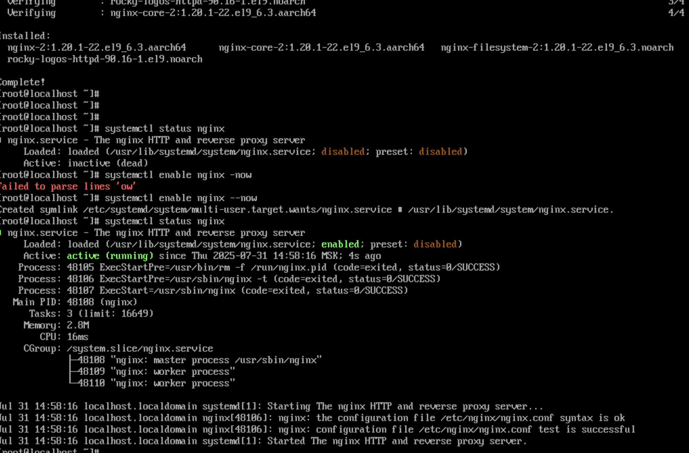
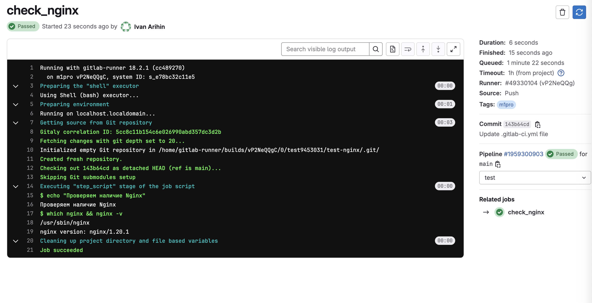
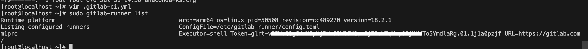
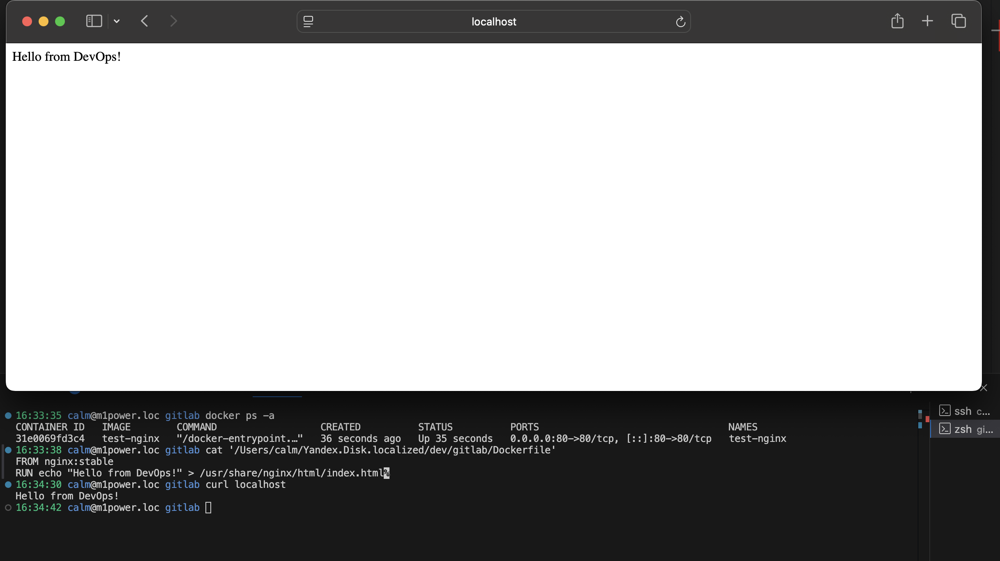
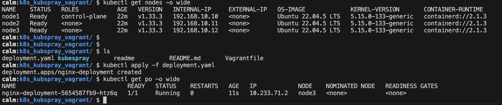

## Тестовое задание: Junior DevOps / Системный администратор (Linux)
### Цель:
Проверить базовые навыки работы с Linux, CI/CD, контейнерами, мониторингом и
автоматизацией.
#### 1. Подготовка тестового окружения:
На своём локальном ПК или виртуалке (например, Ubuntu 20.04+):
- Установите и настройте nginx
- Настройте systemd-сервис, чтобы nginx запускался при старте системы
#### Ожидаемый результат:
- Nginx работает
- systemctl status nginx показывает активное состояние
#### 2. Напишите простой .gitlab-ci.yml файл
#### Сценарий:
Этап test должен запускать проверку наличия установленного nginx
- which nginx && nginx -v
#### Ожидаемый результат:
- Корректный файл .gitlab-ci.yml с минимальным пайплайном
- Комментарии внутри объясняют, что делает каждая стадия
#### 3. Работа с Docker (по желанию, но желательно):
Напишите Dockerfile, который собирает образ с nginx и выводит “Hello from DevOps!” на главной странице
#### Ожидаемый результат:
- Рабочий Dockerfile
- Контейнер поднимается и отвечает на curl localhost или через браузер
#### 4. (На выбор) Мини-задание по YAML / Kubernetes:
Напишите простейший deployment.yaml, который запускает nginx в 1 реплике
#### Ожидаемый результат:
- Корректный YAML-файл, описывающий Deployment
- Используется nginx:stable
- Указаны replicas, containers, ports
#### 5. Ответьте письменно на 3 вопроса:
- Чем отличается apt update от apt upgrade?
- Как вы проверите, слушает ли сервис нужный порт?
- Какие команды вы используете для диагностики сетевых проблем?

## 1. Тестовое окружение и nginx 
Собрали VM с помощью vagrant. Установили и настроили nginx для автостарта


## 2. Простой  [.gitlab-ci.yml](.gitlab-ci.yml) для проверки наличия установленного nginx


## 3. Простой  [Dockerfile](Dockerfile) поднимается nginx и отвечает на curl 

## 4. Простой [deployment.yaml](deployment.yaml) для работы с Kubernetes
### Создаем виртуальные машины согласно ТЗ
`vagrant up`

### Загружаем kubespray (не ищем легких путей и создаем кластер из мастера и 2 воркер нод ;) и дозагружаем зависимости
git clone https://github.com/kubernetes-sigs/kubespray
cd kubespray
pip3 install -r requirements.txt
pip3 install jmespath

### Подготавливаем инвентарь для Kubespray
`cp -rfp inventory/sample inventory/mycluster`
`inventory/mycluster/hosts.yaml # добавляем и редактируем файл с нашими хостами`

### Устанавливаем Kubernetes
ansible-playbook -i inventory/mycluster/hosts.yaml --become --become-user=root -u vagrant cluster.yml

#### При различных ошибках при разворачивании плейбука - исправляем
```
ansible-galaxy collection install ansible.posix
ansible-galaxy collection install community.general
ansible-galaxy collection install kubernetes.core
ansible-galaxy collection install ansible.utils 
ansible-galaxy collection install community.crypto
./Applications/Python\ 3.11/Install\ Certificates.command 
cp kubespray/plugins/modules/kube.py kubespray/library/kube.py 
```
## Проверяем подключение к кластеру 
### Cоздаем директорию локально, если ее нет
`mkdir -p ~/.kube`
### Копируем конфиг из мастер ноды
`vagrant ssh k8s-master -c "sudo cat /etc/kubernetes/admin.conf" > ~/.kube/config`
### Проверяем
`kubectl get nodes`


## 5. Ответы на вопросы
#### Чем отличается apt update от apt upgrade?
apt update - обновляет списки репозиториев, указанные в файле /etc/apt/sources.list , актуальные версии доступных пакетов

apt upgrade - обновляет пакеты до последних доступных версий

#### Как вы проверите, слушает ли сервис нужный порт?
ss -tulpn | grep <порт>

netstat -tulpn | grep <порт>
##### снаружи:
telnet <адрес> <порт>

curl -I <адрес>:<порт>

#### Какие команды вы используете для диагностики сетевых проблем?
ping, traceroute, mtr, nslookup, netstat -tulpn, ip, arp, nmap, curl
